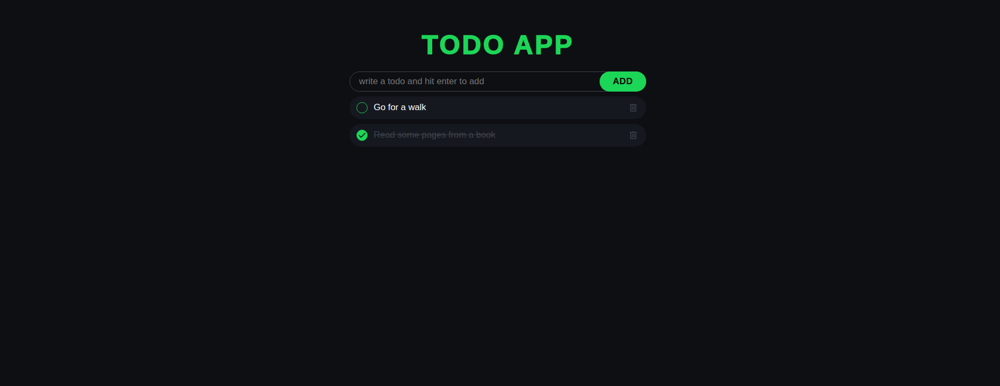

# 📝 Todo App

A simple, responsive Todo application built with **HTML, CSS, and JavaScript**.  
Todos are stored in the browser’s **localStorage**, so they stay saved even after a page refresh.

## 🚀 Features
- Add, toggle, and delete todos
- Custom checkbox with smooth styling
- Persistent storage with localStorage
- Responsive design for desktop & mobile

## 📸 Preview

## 📂 Tech Stack
- **HTML5**
- **CSS3** (responsive + custom styles)
- **Vanilla JavaScript**

---

✨ Built as a learning project to practice DOM manipulation, event handling, and localStorage in JavaScript.
